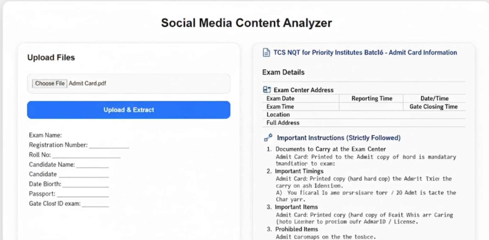

# Social Media Content Analyzer

A production‑quality application designed to analyze uploaded PDF/image documents, extract text using PDF parsing & OCR, and provide actionable insights to improve social media engagement.

This project fulfills the requirements of the **Social Media Content Analyzer** assignment, incorporating document upload, text extraction, OCR processing, clean UI/UX, and structured documentation.

---

## 🚀 Features

### **1. Document Upload**

- Upload **PDF files** and **image files** (JPG, PNG, scanned documents).
- Supports **drag‑and‑drop** and **file picker** upload.
- Real‑time file validation (type/size checks).

### **2. Text Extraction**

- **PDF Parsing**: Extracts text from PDFs while preserving readable formatting.
- **OCR (Optical Character Recognition)**:

  - Extracts text from scanned images using **Tesseract OCR**.
  - Handles noisy or low‑resolution images using preprocessing.

### **3. Engagement Insights**

- Analyzes extracted content and suggests improvements such as:

  - More engaging hooks
  - Readability improvements
  - Hashtag suggestions
  - Content structure recommendations

---
### Screenshots


## 🧰 Tech Stack

### **Frontend**

- React / JavaScript
- Modern UI components
- File drag‑and‑drop support

### **Backend / Processing**

- Node.js / Express (if applicable)
- Tesseract.js for OCR
- pdf-parse or similar library for PDF text extraction

---

## 🏗 Project Structure (Generic)

```
SOCIAL-MEDIA-CONTENT-ANALYZER/
│
├── backend/
│   ├── controllers/
│   │   ├── extractController.js
│   │   └── ocrController.js
│   │
│   ├── routes/
│   │   └── extractRoutes.js
│   │
│   ├── uploads/
│   │   └── (uploaded files...)
│   │
│   ├── services/
│   │   └── geminiService.js     ← (Gemini service)
│   │
│   ├── config.js
│   ├── server.js
│   ├── package.json
│   └── package-lock.json
│
├── frontend/
│   ├── src/
│   │   ├── components/
│   │   │   └── FileUpload.jsx
│   │   │
│   │   ├── pages/
│   │   │   └── Home.jsx
│   │   │
│   │   ├── App.jsx
│   │   ├── main.jsx
│   │   └── styles.css
│   │
│   ├── package.json
│   └── package-lock.json
│
├── .gitignore
└── README.md

```

---

## ⚙️ Installation & Setup

### **1. Clone the Repository**

```bash
git clone <repo-url>
cd project-folder
```

### **2. Install Dependencies**

```bash
npm install
```

### **3. Start Development Server**

```bash
npm run dev
```

### **4. Build for Production**

```bash
npm run build
```

---

## 📄 How It Works

### **PDF Processing**

1. User uploads a PDF.
2. The PDF is parsed using a PDF text extraction library.
3. Text is formatted and sent to the analyzer.

### **OCR Processing**

1. Uploaded image is passed to Tesseract OCR.
2. Text is extracted even from scanned or low‑quality images.
3. Cleaned text is used for further analysis.

### **Engagement Analysis**

- Extracted text is scanned for hashtags, keywords, readability.
- Suggestions are generated based on content patterns.

---

## 🛠 Technical Requirements (Fulfilled)

- Clean, production‑quality code
- Loading states for long-running tasks (OCR, PDF parsing)
- Proper error handling
- Modular component-based architecture
- Simple, well-documented utilities

---

## ✔ Requirements Checklist

| Requirement    | Status               |
| -------------- | -------------------- |
| PDF Upload     | ✔ Completed          |
| Image Upload   | ✔ Completed          |
| Drag and Drop  | ✔ Completed          |
| PDF Parsing    | ✔ Using pdf-parse    |
| OCR            | ✔ Using tesseract.js |
| Loading UI     | ✔ Yes                |
| Error Handling | ✔ Yes                |
| Documentation  | ✔ Yes                |

---


